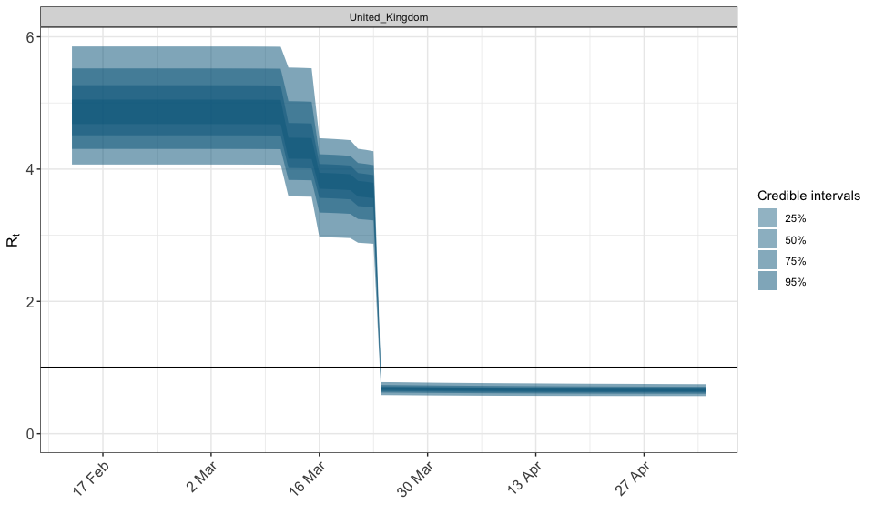
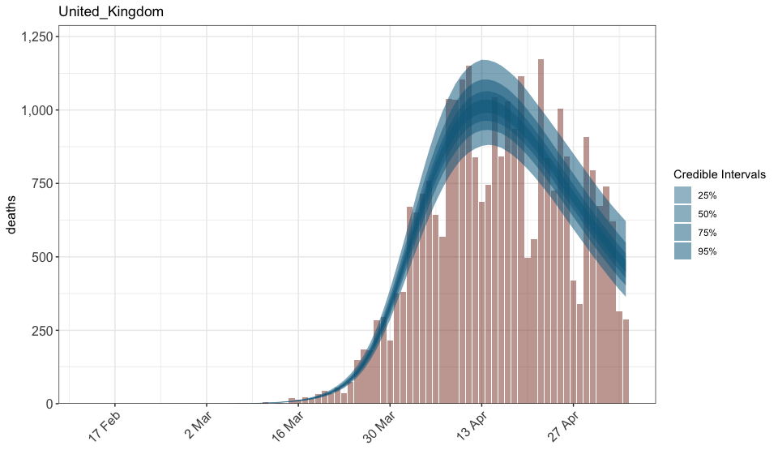

Flexible Epidemic Modeling with epidemia
================

The epidemia package allows researchers to flexibly specify and fit
Bayesian epidemiological models in the style of Flaxman et al. (2020).
The package leverages R’s formula interface to paramaterize the
time-varying reproduction rate in terms of arbitrary covariates.
Multiple countries/states can be modelled simultaneously with multilevel
models. The design of the package has been inspired by, and has borrowed
from, the rstanarm package (Goodrich et al. 2020). epidemia uses rstan
(Stan Development Team 2020) as the backend for fitting models. The
primary model fitting function in epidemia is `epim`.

Please see [here](/vignettes/introduction.md) for a demonstration on how
to use the package.

# Example Usage

``` r
library(epidemia)
data(EuropeCovid)

# Collect args for epim
args <- EuropeCovid
args$formula <- R(country, date) ~ schools_universities + self_isolating_if_ill +
  public_events + lockdown + social_distancing_encouraged
args$algorithm <- "sampling"
args$prior <- shifted_gamma(shape = 1/6, scale = 1, shift = -log(1.05)/6)
args$group_subset <- c("Germany", "United_Kingdom")

#sample
options(mc.cores=parallel::detectCores())
fit <- do.call("epim", args)
```

``` r
# Inspect Rt
plot_rt(fit, group = "United_Kingdom", levels = c(25,50,75,95))
```

<!-- -->

``` r
# And deaths
plot_obs(fit, type = "deaths", group = "United_Kingdom", levels = c(25,50,75,95))
```

<!-- -->

# References

<div id="refs" class="references hanging-indent">

<div id="ref-Flaxman2020">

Flaxman, Seth, Swapnil Mishra, Axel Gandy, H Juliette T Unwin, Thomas A
Mellan, Helen Coupland, Charles Whittaker, et al. 2020. “Estimating the
effects of non-pharmaceutical interventions on COVID-19 in Europe.”
*Nature*. <https://doi.org/10.1038/s41586-020-2405-7>.

</div>

<div id="ref-rstanarm">

Goodrich, Ben, Jonah Gabry, Imad Ali, and Sam Brilleman. 2020.
“Rstanarm: Bayesian Applied Regression Modeling via Stan.”
<https://mc-stan.org/rstanarm>.

</div>

<div id="ref-rstan">

Stan Development Team. 2020. “RStan: The R Interface to Stan.”
<http://mc-stan.org/>.

</div>

</div>
