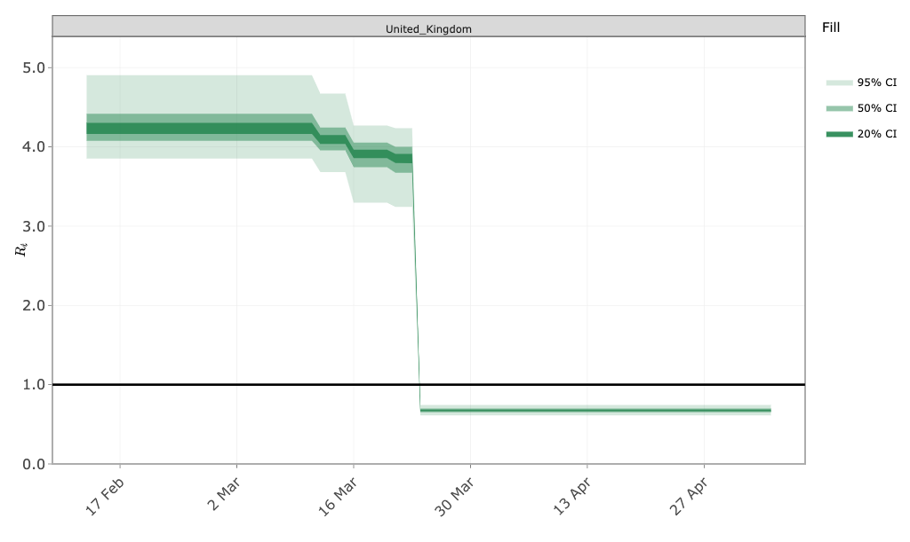

epidemia
================

The epidemia package allows researchers to flexibly specify and fit
Bayesian epidemiological models in the style of [Flaxman et
al. (2020)](https://www.nature.com/articles/s41586-020-2405-7). The
package leverages R’s formula interface to paramaterize the time-varying
reproduction rate as a function of covariates. Multiple populations can
be modeled simultaneously with hierarchical models. The design of the
package has been inspired by, and has borrowed from,
[rstanarm](https://mc-stan.org/rstanarm/) (Goodrich et al. 2020).
epidemia uses [rstan](https://mc-stan.org/rstan/) (Stan Development Team
2020) as the backend for fitting models.

## Disclaimer

This is an early beta release of the package. As a beta release, there
will be regular updates with additional features and more extensive
testing. Any feedback is greatly appreciated - in particular if you find
bugs, find the documentation unclear, or have feature requests, please
report them
[here](https://github.com/ImperialCollegeLondon/epidemia/issues).

This version of epidemia could be subject to future changes to the
interface.

## Installation
epidemia requires R v3.5.0 or above. The latest version of R can be downloaded 
[here](https://cloud.r-project.org/bin/).

The package can be installed directly from 
github. However, this requires you to have a working C++ toolchain. To ensure that this 
is working, please first install **rstan** by following these 
[installation instructions](https://github.com/stan-dev/rstan/wiki/RStan-Getting-Started).

After installing **rstan**, running
``` r
#install.packages(devtools)
devtools::install_github("ImperialCollegeLondon/epidemia")
```
will install the latest development version of **epidemia**.

If using windows, you can alternatively install the [binary](https://github.com/ImperialCollegeLondon/epidemia/releases/latest).

Vignettes are not currently included in the package because they are
computationally demanding, and are best viewed online.

## Getting Started

The best way to get started is to read the
[vignettes](articles/index.html).

  - [Flexible Epidemic Modeling with
    epidemia](articles/introduction.html) is the main vignette,
    introducing the model framework and the primary model fitting
    function `epim`.
  - [Using Priors](articles/priors.html) gives important details behind
    using prior distributions for model paramters.
  - [Incidence Only](articles/IncidenceOnly.html) gives examples of
    fitting models using only incidence data and a discrete serial
    interval.
  - [Time-Dependent Modeling](articles/TimeDependentR.html) demonstrate
    how to model weekly changes in the reproduction number as a random
    walk.
  - [Resolving Problems](articles/ResolvingProblems.html) will
    demonstrate how to resolve common computational problems when using the package.
  - [Plotting](articles/plotting.html) gives examples of the different visualisation
    options available in epidemia.
  - [Forecast evaluation](articles/foreacst_evaluation.html) shows how to evaluate a
    model's forecast using its prediction error and the mean coverage of the credible
    intervals.

## Usage

``` r
data(EuropeCovid)
# Collect args for epim
args <- EuropeCovid
args$algorithm <- "sampling"
args$group_subset <- c("Germany", "United_Kingdom")
args$sampling_args <- list(iter=1e3,seed=12345)

# model for reproduction number
args$rt <- epirt(
  formula = R(country, date) ~ schools_universities + self_isolating_if_ill + 
    public_events + lockdown + social_distancing_encouraged,
  prior = shifted_gamma(shape = 1/6, scale = 1, shift = log(1.05)/6)
)

# model for daily death observations
deaths <- epiobs(
  formula = deaths(country, date) ~ 1,
  prior_intercept = rstanarm::normal(0.01, 0.0001),
  i2o = EuropeCovid$obs$deaths$i2o,
  prior_aux = rstanarm::normal(location=10, scale=2)
)

args$obs <- list(deaths = deaths)

fit <- do.call(epim, args)
```

``` r
# Inspect Rt
plot_rt(fit, group = "United_Kingdom", plotly=TRUE)
```

<!-- -->

``` r
# And deaths
plot_obs(fit, type = "deaths", group = "United_Kingdom", plotly=TRUE)
```
<!-- -->
