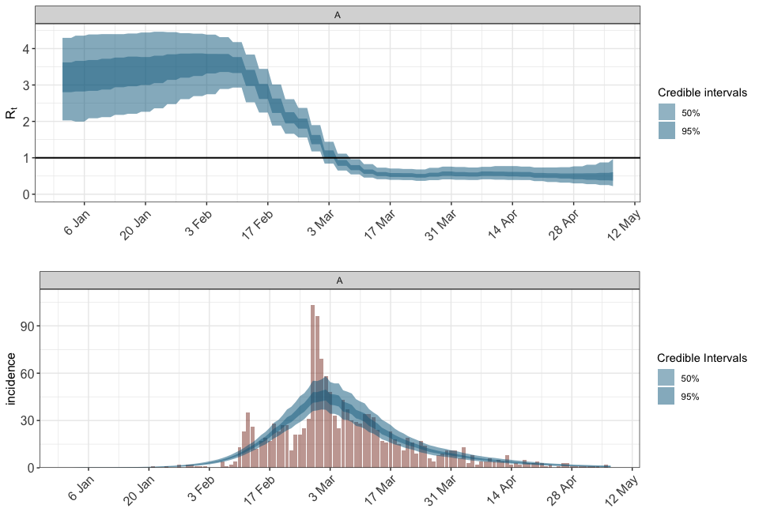
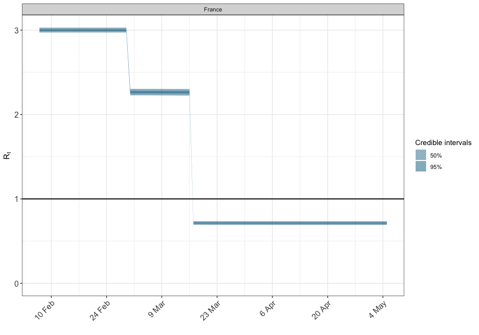
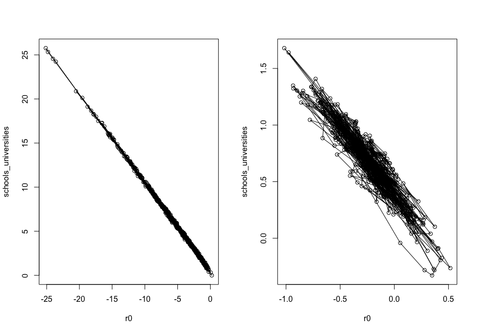

Resolving Problems
================

## SARS 2003 - using cumulatives to obtain starting values for MCMC

We use the SARS data from 2003 as an example.

In the example below, the sampler would have difficulties converging
with the default random starting values of rstan. It usually stays in a
part of the parameter space where all of the population gets infected.

Below is one approach how to resolve this. This is at the moment
hard-coded. Future versions of epidemia may provide a more convenient
way of doing this.

We first fit the model to cumulative counts to get starting values for
the main run (the fit to cumulative counts will not be correct itself
due an assumed independence of the cumulative counts).

First we load the data.

``` r
library(epidemia)
data("SARS2003")
options(mc.cores = parallel::detectCores())
print(SARS2003)
```

    ## $incidence
    ##   [1]   1   0   0   1   0   0   2   0   2   2   1   1   1   0   0   0   4   1
    ##  [19]   2   4  13  23  35  26  12  17  19  17  28  23  27  27  11  21  21  25
    ##  [37]  31 103  96  69  58  48  33  25  43  37  30  29  28  34  34  32  24  17
    ##  [55]  16  23  18  15  11  19  16   9  17  14   6   4   8   9  11  11  11   6
    ##  [73]  13   3   8   2   4   4   6   4   5   4   8   2   3   2   5   3   3   4
    ##  [91]   3   1   2   0   1   3   3   1   1   1   1   1   1   1   0   2   0
    ## 
    ## $si_distr
    ##  [1] 0.000 0.001 0.012 0.043 0.078 0.104 0.117 0.116 0.108 0.094 0.078 0.063
    ## [13] 0.049 0.038 0.028 0.021 0.015 0.011 0.008 0.005 0.004 0.003 0.002 0.001
    ## [25] 0.001

Then we set up and run the model for cumulative observed cases.

``` r
sars <- SARS2003
sars$incidence <- c(rep(NA,20),cumsum(sars$incidence)) ## pad before initialisation
sars$sarsdate <- as.Date("2003-01-01")+seq(0,along.with=sars$incidence)
obs <- !is.na(sars$incidence)

args <- list(formula=Rt(country,date)~rw(date,3),
     data=data.frame(country="A",date=sars$sarsdate),
             obs=list(
                 incidence=list(
                     odata=data.frame(country="A",
                                      date=sars$sarsdate[obs],incidence=sars$incidence[obs]),
                     rates=list(means=data.frame(factor("A"),1),
                                scale=.01),
                     pvec=c(.25,.5,.75,1),
                     ptype="distribution"
                 )
             ),
             seed_days=7,
             algorithm="sampling",
             r0=3,
             pops=data.frame(country="A",pop=1e6),
             si=sars$si,
             prior = rstanarm::normal(location=0,scale=.2),
             prior_intercept = rstanarm::normal(location=0,scale=.5),
             prior_tau = rstanarm::exponential(rate=4)             
     )
```

``` r
args$debug=TRUE ## to get original parameter values
args$sampling_args <- list(iter=100,control=list(adapt_delta=0.95,max_treedepth=15),seed=77239,chains=1)
fitpre <- do.call("epim",args)
```

    ## Warning: The largest R-hat is 1.71, indicating chains have not mixed.
    ## Running the chains for more iterations may help. See
    ## http://mc-stan.org/misc/warnings.html#r-hat

    ## Warning: Bulk Effective Samples Size (ESS) is too low, indicating posterior means and medians may be unreliable.
    ## Running the chains for more iterations may help. See
    ## http://mc-stan.org/misc/warnings.html#bulk-ess

    ## Warning: Tail Effective Samples Size (ESS) is too low, indicating posterior variances and tail quantiles may be unreliable.
    ## Running the chains for more iterations may help. See
    ## http://mc-stan.org/misc/warnings.html#tail-ess

The above run may give some error messages, but they can be ignored as
this run is only used to get starting values for the chains of the main
run.

Now update the model to work with individually reported cases.

``` r
sars <- SARS2003
sars$incidence <- c(rep(NA,20),sars$incidence) ## pad before initialisation
sars$sarsdate <- as.Date("2003-01-01")+seq(0,along.with=sars$incidence)
obs <- !is.na(sars$incidence)
args$obs=list(
    incidence=list(
        odata=data.frame(country="A",
                         date=sars$sarsdate[obs],incidence=sars$incidence[obs]),
        rates=list(means=data.frame(factor("A"),1),
                   scale=.01),
        pvec=c(.25,.25,.25,.25),
        ptype="density"
    )
)
```

Next we prepare the initialisation values. This is very crude at the
moment and better ways probably do exist.

``` r
initf <- function(){
    i <- sample(1:50,1)
    res <- lapply(rstan::extract(fitpre$stanfit),
                  function(x) {
                      if (length(dim(x))==1){
                          as.array(x[i])
                      }
                      else if (length(dim(x))==2)
                          x[i,]
                      else x[i,,]
                  }
                  )
    for (j in names(res)){
        if (length(res[j])==1)
            res[[j]] <- as.array(res[[j]])
    }
    res$tau_raw <- c(res$tau_raw)
    res$noise<- NULL
    res
}
args$sampling_args <- list(iter=1000,control=list(adapt_delta=0.95,max_treedepth=15),seed=713,init=initf)
```

Now we starte the main sampling run.

``` r
fit <- do.call("epim",args)
```

And here are the resulting fits.

``` r
library(gridExtra)
grid.arrange(plot_rt(fit),
             plot_obs(fit,"incidence"),
             nrow=2)
```

<!-- -->

## Collinearity

In our experience, a leading cause of pathologies in the model fitting
stage is collinearity between the predictors explaining the time-varying
reproduction number. This can lead to divergent transitions and long
sampling times.

Take the example of modeling the effect of several non-pharmaceutical
interventions (NPIs). There are two primary reasons why these effects
can be highly confounded. Most obviously, the interventions will often
take place in quick succession, and so they will be highly collinear.
The second cause is the time distribution from infection to an event -
for example a death. This is often such that conditional on observing a
death at a particular time, there is a wide range of plausible dates at
which the individual was infected. Any effects on the reproduction
number from interventions occuring close to one-another will be smoothed
over in the death data, and the signal as to which intervention actually
had an effect becomes weaker.

One possible remedy for this is to pool the effects over different
groups. This incorporates more data to delineate each effect. Another
approach is to regularize the problem by using more informative priors.
Of course this should be done in a principled manner; for example by
using results from previous studies.

In this section, we illustrate this phenomenon with a simulated dataset.
The code below simulates death data using an assumed initial
reproduction number, and assumed effect sizes for the
`schools_universities` and `lockdown` NPIs. The aim will be to recover
the parameters under which the data was simulated.

``` r
data("EuropeCovid")
EuropeCovid$data[EuropeCovid$data$country == "France" & EuropeCovid$data$date >= as.Date("2020-03-01"), "schools_universities"] = 1
args <- EuropeCovid
args$group_subset <- "France"
args$algorithm <- "sampling"
args$sampling_args <- list(iter = 1e3, seed=12345)
args$formula <- R(country, date) ~ schools_universities + lockdown
args$prior_PD <- TRUE

# set some reasonable prior values
args$r0 <- 3
args$prior_intercept <- rstanarm::normal(location=0, scale = 0.01)
args$prior <- rstanarm::normal(location = c(0.5,1.5), scale=0.01)

fm <- do.call("epim", args)
# look at prior predictive distribution
plot_rt(fm)
```

<!-- --> In
the above code, we have assumed that the initial reproduction number is
close to 3, and have assumed regression parameters for the
schools/universities and lockdown NPIs of around 0.5 and 1.5
respectively. Now we simulate daily death counts under this model, which
will be used in place of the true death data.

``` r
# use mean data from prior run
obs <- posterior_obs(fm, type="deaths")$France
dates <- obs[,1]
obs <- as.integer(rowMeans(obs[,-1]))

# replace France deaths data with simulated data
deaths <- args$obs$deaths
w <- deaths$odata$country == "France"
deaths$odata <- deaths$odata[w,]
deaths$odata$deaths <- obs
args$obs$deaths <- deaths
```

Fitting the model to the simulared data with uninformative priors for
the initial reproduction number and effects.

``` r
# fit the model with uninformative priors
args$prior_PD <- FALSE
args$prior_intercept <- rstanarm::normal()
args$prior <- rstanarm::normal()
system.time(fm2 <- do.call("epim", args))
```

    ## $prior
    ## $prior$dist
    ## [1] "normal"
    ## 
    ## $prior$location
    ## [1] 0 0
    ## 
    ## $prior$shape
    ## [1] 0 0
    ## 
    ## $prior$scale
    ## [1] 2.5 2.5
    ## 
    ## $prior$shift
    ## [1] 0 0
    ## 
    ## $prior$adjusted_scale
    ## NULL
    ## 
    ## $prior$df
    ## NULL
    ## 
    ## 
    ## $prior_intercept
    ## $prior_intercept$dist
    ## [1] "normal"
    ## 
    ## $prior_intercept$location
    ## [1] 0
    ## 
    ## $prior_intercept$scale
    ## [1] 10
    ## 
    ## $prior_intercept$adjusted_scale
    ## NULL
    ## 
    ## $prior_intercept$df
    ## NULL

    ## Warning: There were 530 transitions after warmup that exceeded the maximum treedepth. Increase max_treedepth above 10. See
    ## http://mc-stan.org/misc/warnings.html#maximum-treedepth-exceeded

    ## Warning: Examine the pairs() plot to diagnose sampling problems

    ##    user  system elapsed 
    ## 906.082   4.690 269.255

Notice the warnings over exceeding the maximum-tree depath and the long
run time. The reason for this will become clear soon. But first we
attempt to regularize the problem by assuming more information on the
initial reproduction number.

``` r
# more informative prior intercept
args$prior_intercept <- rstanarm::normal(scale=0.2)
system.time(fm3 <- do.call("epim", args))
```

    ##    user  system elapsed 
    ## 214.190   2.253  82.440

This seems to more computationally stable. As shown below, the problem
is caused by posterior correlation between the initial reproduction rate
and the effect size of the schools/universities NPI. This NPI occurs
before there is much informative data on deaths, and when the number of
infections is likely to be quite low. Therefore it is difficult to
distinguish whether early on in the disease there was a high
reproduction rate and a large effect from the NPI, or a lower initial
reproduction rate and a less substantial effect.

We now plot the posterior correlations between these two parameters.

``` r
par(mfrow=c(1,2))
mat <- as.array(fm2)
r0 <- mat[,1,"(Intercept)"]
schools_universities <- mat[,1,"schools_universities"]
plot(r0, schools_universities, type = "o")

mat <- as.array(fm3)
r0 <- mat[,1,"(Intercept)"]
schools_universities <- mat[,1,"schools_universities"]
plot(r0, schools_universities, type = "o")
```

<!-- -->
The left hand plot shows the posterior distribution from `fm2`, where
less informative priors were used. The divergent transitions appear to
be caused by the small step-size required to traverse the distribution
horizontally/vertically, and the large step size desired for traversing
the diagonal; there is a *ridge* in the posterior. For more information
on why this can pose a problem for Hamiltonian Monte Carlo, please refer
to [the stan user
guide](https://mc-stan.org/docs/2_20/stan-users-guide/collinearity-section.html).
Using stronger prior information reduces the posterior correlation and
the sampler explores the space better, as shown in the right hand plot.

``` r
print(fm2, digits=2)
```

    ## 
    ## Rt regression parameters:
    ## -----
    ## coefficients:
    ##                      Median MAD_SD
    ## (Intercept)          -1.76   1.24 
    ## schools_universities  2.26   1.28 
    ## lockdown              1.50   0.14 
    ## 
    ## Other model parameters:
    ## -----
    ##                      Median MAD_SD
    ## seeds[France]         4.32   2.59 
    ## tau                  13.52  12.69 
    ## phi                  21.36   3.32 
    ## noise[France,deaths]  1.00   0.10

``` r
print(fm3, digits=2)
```

    ## 
    ## Rt regression parameters:
    ## -----
    ## coefficients:
    ##                      Median MAD_SD
    ## (Intercept)          0.02   0.13  
    ## schools_universities 0.53   0.15  
    ## lockdown             1.40   0.11  
    ## 
    ## Other model parameters:
    ## -----
    ##                      Median MAD_SD
    ## seeds[France]        36.18  10.26 
    ## tau                  34.68  22.11 
    ## phi                  21.01   3.40 
    ## noise[France,deaths]  1.01   0.10
