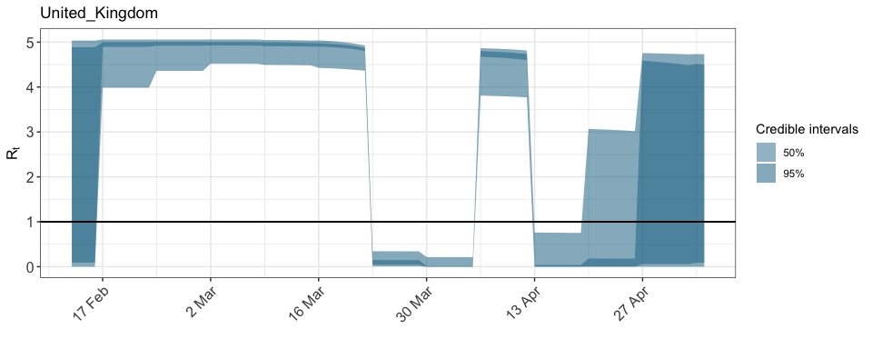

Introduction to epidemia
================

This vignette is very much a work in progress, and will be regularly
updated. It aims to demonstrate basis usage of the **epidemia** package.
The main work is done in the `epim` function. Before continuing, please
read the documentation for a more detailed description of this function.

## Europe Data

The package contains the dataset used in the Nature paper. Load with

``` r
library(epidemia)
data("EuropeCovid")
```

`EuropeCovid` is a list containing most of the information required for
`epim`. These fields are named as follows.

``` r
names(EuropeCovid)
```

    ## [1] "data" "obs"  "pops" "si"

We start by discussing the ‘data’ argument. This is a dataframe with
columns referring to possible covariates for modelling \(R_{tm}\). It
contains one column which will specify the ‘groups’ to be modelled, and
an additonal column giving the dates corresponding to the covariate
data. Note that the covariates included here will not be used unless
specified in the formula argument of `epim` – more on this below.

``` r
args <- EuropeCovid
data <- args$data
head(data)
```

    ##   country       date schools_universities self_isolating_if_ill public_events
    ## 1 Austria 2020-02-22                    0                     0             0
    ## 2 Austria 2020-02-23                    0                     0             0
    ## 3 Austria 2020-02-24                    0                     0             0
    ## 4 Austria 2020-02-25                    0                     0             0
    ## 5 Austria 2020-02-26                    0                     0             0
    ## 6 Austria 2020-02-27                    0                     0             0
    ##   lockdown social_distancing_encouraged
    ## 1        0                            0
    ## 2        0                            0
    ## 3        0                            0
    ## 4        0                            0
    ## 5        0                            0
    ## 6        0                            0

The `obs` argument is itself a list of lists. Each element of `obs` is a
type of observation. This could for example be death, incidence, or
hospitalisation counts. Following the Nature paper, we only consider
death counts here.

``` r
deaths <- args$obs$deaths
names(deaths)
```

    ## [1] "obs"   "pvec"  "rates"

`epim` requires a formula, which specifies the model that will be fit.
At the moment, the terms in the formula must correspond to the names of
columns in `data`. This will be relaxed in future versions (in line with
other model fitting functions like `lm`, `glm`).

For simplicity, we will only consider a single country - specifically
the UK.

``` r
w <- data$country %in% "United_Kingdom"
data <- data[w,]
args$data <- data
```

### Model 1

We start by fitting a simple model with the only covariate being the
indicator for lockdown. This is intuitively specified as

``` r
args$formula <- R(country, date) ~ 0 + lockdown 
```

The LHS of the formula always takes the form `R(x,y)` for some columns
`x` and `y` in `data`. Epim will always use the factor levels found in
`data$x` as the groups to model, and will use `data$y` to specify the
modeled dates for each group. Since we removed all countries other than
`United_Kingdom` from `data$country`, `epim` will only model the UK. The
dates must be a consecutive range, and there must be no missing
covariate data in the columns specified on the R.H.S. of the above
formula. The first date found for each group is assumed to be the
beginning of the epidemic, and seeding of infections begins from this
date.

We fit this model using variational bayes as it is quick. For a full
analysis, MCMC sampling should be used.

``` r
# can switch out for "sampling" if desired
args$algorithm <- "meanfield"
fit <- do.call("epim", args)
```

    ## Warning: Levels Austria Belgium Denmark France Germany Italy Norway Spain Sweden
    ## Switzerland in obs$deaths$obs were not found in 'data'. Removing.

    ## Warning: Group: United_Kingdom, found dates in obs$deaths$obs outside of
    ## 2020-02-13 : 2020-05-05. Trimming...

    ## Warning: Column `group` joining factors with different levels, coercing to
    ## character vector

    ## Chain 1: ------------------------------------------------------------
    ## Chain 1: EXPERIMENTAL ALGORITHM:
    ## Chain 1:   This procedure has not been thoroughly tested and may be unstable
    ## Chain 1:   or buggy. The interface is subject to change.
    ## Chain 1: ------------------------------------------------------------
    ## Chain 1: 
    ## Chain 1: 
    ## Chain 1: 
    ## Chain 1: Gradient evaluation took 0.000306 seconds
    ## Chain 1: 1000 transitions using 10 leapfrog steps per transition would take 3.06 seconds.
    ## Chain 1: Adjust your expectations accordingly!
    ## Chain 1: 
    ## Chain 1: 
    ## Chain 1: Begin eta adaptation.
    ## Chain 1: Iteration:   1 / 250 [  0%]  (Adaptation)
    ## Chain 1: Iteration:  50 / 250 [ 20%]  (Adaptation)
    ## Chain 1: Iteration: 100 / 250 [ 40%]  (Adaptation)
    ## Chain 1: Iteration: 150 / 250 [ 60%]  (Adaptation)
    ## Chain 1: Iteration: 200 / 250 [ 80%]  (Adaptation)
    ## Chain 1: Success! Found best value [eta = 1] earlier than expected.
    ## Chain 1: 
    ## Chain 1: Begin stochastic gradient ascent.
    ## Chain 1:   iter             ELBO   delta_ELBO_mean   delta_ELBO_med   notes 
    ## Chain 1:    100         -466.095             1.000            1.000
    ## Chain 1:    200         -440.705             0.529            1.000
    ## Chain 1:    300         -378.313             0.408            0.165
    ## Chain 1:    400         -363.362             0.316            0.165
    ## Chain 1:    500         -366.478             0.254            0.058
    ## Chain 1:    600         -364.333             0.213            0.058
    ## Chain 1:    700         -358.041             0.185            0.041
    ## Chain 1:    800         -354.997             0.163            0.041
    ## Chain 1:    900         -354.420             0.145            0.018
    ## Chain 1:   1000         -356.370             0.131            0.018
    ## Chain 1:   1100         -373.025             0.036            0.018
    ## Chain 1:   1200         -357.384             0.034            0.018
    ## Chain 1:   1300         -352.342             0.019            0.014
    ## Chain 1:   1400         -355.471             0.016            0.009   MEDIAN ELBO CONVERGED
    ## Chain 1: 
    ## Chain 1: Drawing a sample of size 1000 from the approximate posterior... 
    ## Chain 1: COMPLETED.

    ## Warning: Pareto k diagnostic value is 1.13. Resampling is disabled. Decreasing
    ## tol_rel_obj may help if variational algorithm has terminated prematurely.
    ## Otherwise consider using sampling instead.

We can quickly plot the estimated \(R_{tm}\) with the `plot_rt`
function, as follows:

``` r
plot_rt(fit, group = "United_Kingdom")
```

<!-- -->

### Model 2

We also demonstrate how to use random effects terms in the formula. We
will fit a simple model replacing the lockdown covariate with a ‘week
specific’ effect. To do this, we augment `data` to store the week as a
covariate, and update the formula

``` r
data$week <- as.factor(format(data$date, "%V"))
args$data <- data
args$formula <- R(country,date) ~ 0  + (1 | week)
```

Fitting the model

``` r
fit <- do.call("epim", args)
```

    ## Warning: Levels Austria Belgium Denmark France Germany Italy Norway Spain Sweden
    ## Switzerland in obs$deaths$obs were not found in 'data'. Removing.

    ## Warning: Group: United_Kingdom, found dates in obs$deaths$obs outside of
    ## 2020-02-13 : 2020-05-05. Trimming...

    ## Warning: Column `group` joining factors with different levels, coercing to
    ## character vector

    ## Warning: extra argument(s) 'obs', 'pops', 'si', 'algorithm' disregarded

    ## Chain 1: ------------------------------------------------------------
    ## Chain 1: EXPERIMENTAL ALGORITHM:
    ## Chain 1:   This procedure has not been thoroughly tested and may be unstable
    ## Chain 1:   or buggy. The interface is subject to change.
    ## Chain 1: ------------------------------------------------------------
    ## Chain 1: 
    ## Chain 1: 
    ## Chain 1: 
    ## Chain 1: Gradient evaluation took 0.000252 seconds
    ## Chain 1: 1000 transitions using 10 leapfrog steps per transition would take 2.52 seconds.
    ## Chain 1: Adjust your expectations accordingly!
    ## Chain 1: 
    ## Chain 1: 
    ## Chain 1: Begin eta adaptation.
    ## Chain 1: Iteration:   1 / 250 [  0%]  (Adaptation)
    ## Chain 1: Iteration:  50 / 250 [ 20%]  (Adaptation)
    ## Chain 1: Iteration: 100 / 250 [ 40%]  (Adaptation)
    ## Chain 1: Iteration: 150 / 250 [ 60%]  (Adaptation)
    ## Chain 1: Iteration: 200 / 250 [ 80%]  (Adaptation)
    ## Chain 1: Success! Found best value [eta = 1] earlier than expected.
    ## Chain 1: 
    ## Chain 1: Begin stochastic gradient ascent.
    ## Chain 1:   iter             ELBO   delta_ELBO_mean   delta_ELBO_med   notes 
    ## Chain 1:    100         -480.844             1.000            1.000
    ## Chain 1:    200         -496.133             0.515            1.000
    ## Chain 1:    300         -410.977             0.413            0.207
    ## Chain 1:    400         -399.950             0.316            0.207
    ## Chain 1:    500         -387.961             0.259            0.031
    ## Chain 1:    600         -386.805             0.217            0.031
    ## Chain 1:    700         -387.085             0.186            0.031
    ## Chain 1:    800         -384.601             0.163            0.031
    ## Chain 1:    900         -378.012             0.147            0.028
    ## Chain 1:   1000         -384.314             0.134            0.028
    ## Chain 1:   1100         -377.847             0.036            0.017
    ## Chain 1:   1200         -376.243             0.033            0.017
    ## Chain 1:   1300         -376.615             0.012            0.016
    ## Chain 1:   1400         -376.345             0.010            0.006   MEAN ELBO CONVERGED   MEDIAN ELBO CONVERGED
    ## Chain 1: 
    ## Chain 1: Drawing a sample of size 1000 from the approximate posterior... 
    ## Chain 1: COMPLETED.

    ## Warning: Pareto k diagnostic value is 1.42. Resampling is disabled. Decreasing
    ## tol_rel_obj may help if variational algorithm has terminated prematurely.
    ## Otherwise consider using sampling instead.

and plotting

``` r
plot_rt(fit, "United_Kingdom")
```

<!-- -->

### Model 3

We can mix fixed effects and random effects…

``` r
args$formula <- R(country,date) ~ 0 + lockdown  + (1 | week)
fit <- do.call("epim", args)
```

    ## Warning: Levels Austria Belgium Denmark France Germany Italy Norway Spain Sweden
    ## Switzerland in obs$deaths$obs were not found in 'data'. Removing.

    ## Warning: Group: United_Kingdom, found dates in obs$deaths$obs outside of
    ## 2020-02-13 : 2020-05-05. Trimming...

    ## Warning: Column `group` joining factors with different levels, coercing to
    ## character vector

    ## Warning: extra argument(s) 'obs', 'pops', 'si', 'algorithm' disregarded

    ## Chain 1: ------------------------------------------------------------
    ## Chain 1: EXPERIMENTAL ALGORITHM:
    ## Chain 1:   This procedure has not been thoroughly tested and may be unstable
    ## Chain 1:   or buggy. The interface is subject to change.
    ## Chain 1: ------------------------------------------------------------
    ## Chain 1: 
    ## Chain 1: 
    ## Chain 1: 
    ## Chain 1: Gradient evaluation took 0.000388 seconds
    ## Chain 1: 1000 transitions using 10 leapfrog steps per transition would take 3.88 seconds.
    ## Chain 1: Adjust your expectations accordingly!
    ## Chain 1: 
    ## Chain 1: 
    ## Chain 1: Begin eta adaptation.
    ## Chain 1: Iteration:   1 / 250 [  0%]  (Adaptation)
    ## Chain 1: Iteration:  50 / 250 [ 20%]  (Adaptation)
    ## Chain 1: Iteration: 100 / 250 [ 40%]  (Adaptation)
    ## Chain 1: Iteration: 150 / 250 [ 60%]  (Adaptation)
    ## Chain 1: Iteration: 200 / 250 [ 80%]  (Adaptation)
    ## Chain 1: Success! Found best value [eta = 1] earlier than expected.
    ## Chain 1: 
    ## Chain 1: Begin stochastic gradient ascent.
    ## Chain 1:   iter             ELBO   delta_ELBO_mean   delta_ELBO_med   notes 
    ## Chain 1:    100         -467.577             1.000            1.000
    ## Chain 1:    200         -435.816             0.536            1.000
    ## Chain 1:    300         -401.294             0.386            0.086
    ## Chain 1:    400         -370.407             0.311            0.086
    ## Chain 1:    500         -380.627             0.254            0.083
    ## Chain 1:    600         -363.956             0.219            0.083
    ## Chain 1:    700         -360.758             0.189            0.073
    ## Chain 1:    800         -357.941             0.166            0.073
    ## Chain 1:    900         -379.342             0.154            0.056
    ## Chain 1:   1000         -384.791             0.140            0.056
    ## Chain 1:   1100         -362.061             0.047            0.056
    ## Chain 1:   1200         -359.946             0.040            0.046
    ## Chain 1:   1300         -359.640             0.031            0.027
    ## Chain 1:   1400         -356.320             0.024            0.014
    ## Chain 1:   1500         -360.367             0.022            0.011
    ## Chain 1:   1600         -357.536             0.019            0.009   MEDIAN ELBO CONVERGED
    ## Chain 1: 
    ## Chain 1: Drawing a sample of size 1000 from the approximate posterior... 
    ## Chain 1: COMPLETED.

    ## Warning: Pareto k diagnostic value is 1.12. Resampling is disabled. Decreasing
    ## tol_rel_obj may help if variational algorithm has terminated prematurely.
    ## Otherwise consider using sampling instead.

``` r
plot_rt(fit, "United_Kingdom")
```

<!-- -->
